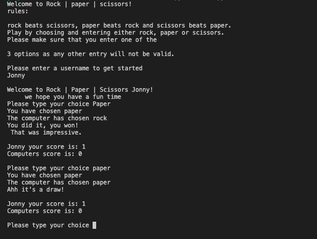
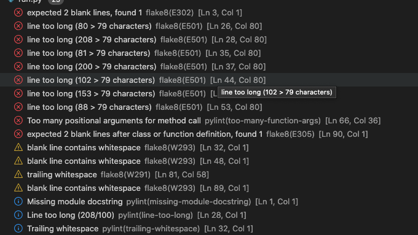
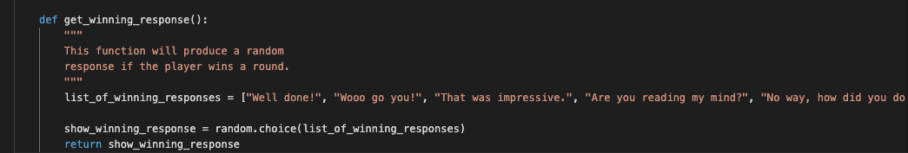
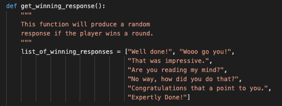

# Rock | Paper | Scissors

## Introduction

Rock paper and scissors is a Python terminal game which runs in the mock terminal on Heroku.

This is a great game for everyone of all ages to enjoy.
A player can challenge the computer to a game. Rules are simple: rock beat scissors, paper beats rock and scissors beats paper.

## Table of contents
* [User goals](#user-goals)
* [Features](#Features)
* [Technology](#Technology)
* [Testing](#Testing)
* [Deployment](#Deployment)
* [Credits](#Credits)
* [Screenshots](#Screenshots)

# User Goals
## All User Goals
- To enjoy a fun game with no bugs or issues.

[Back to Table of contents](#table-of-contents)

## Website Owner Business Goals
- To provide a game which is easy and fun to play.

# Features
You are able to set your own username which will be used throughout the game!

To play the game the player can type one of the 3 prompts.
Either Rock, Paper or Scissors.

With added validation the user can only select one of the 3 prompts or else the game will not work.
However, with the added element of .lower() the player can choose to right in uppercase or lowercase, the game will continue to work as expected.

Once the player has chosen their prompt the computer will pick one at random.

Finally the program will work out who has won the round and will display a statement on the screen with the new updated scoreboard.

[Back to Table of contents](#table-of-contents)

# Technology
### Python
* As a programming language
### GitHub
* As a software hosting platform to keep the project in a remote location.
### Git
* As a version-control system tracking.
### Gitpod
* As a development hosting platform.

[Back to Table of contents](#table-of-contents)

# Testing
Due to the nature of the project, testing has been implemented throughout the entire project mainly debugging through running the program in the terminal as well as debugging using the python debugger.

## Issues Found During Site Development
### Error

 
Once most of my code was completed I realised there was a bunch of errors throughout my code. I didn't realise that you could only have a line with 79 characters. Therefore I had to go through the code until all of the errors were gone.
 

### Image of section of code before I fixed the errors

 

### Image of section of code after I fixed the errors

 

## Code Validation

At the end of the project I used 1 website to validate the code.
 * [PEP3 validator](https://http://pep8online.com/) to validate Python
 All code passed with no errors or warnings.

[Back to Table of contents](#table-of-contents)

# Deployment
The site was deployed via Heroku, and the live link can be found here - [Rock, Paper, Scissors Link]()

### Project Deployment
To deploy the project through Heroku I followed these steps:
- Sign up / Log in to [Heroku](https://www.heroku.com/)
- From the main Heroku Dashboard page select 'New' and then 'Create New App'
- Give the project a name - I entered rock-paper-scissors-python-g and select a suitable region, then select create app. The name for the app must be unique.
- This will create the app within Heroku and bring you to the deploy tab. From the sub menu at the top, navigate to the settings tab.
- This next step is required for creating the app when using the CI Python Deployment Template. If you created your own program without using the CI Template, you might not need to add a config var.
- In the config vars section select the reveal config vars button. This will display the current config vars for the app, there should be nothing already there.
- In the KEY input field input PORT all in capitals, then in the VALUE field input 8000 and select the Add button to the right.
- Next select the add buildpack button below the config vars section.
- In the pop-up window select Python as your first build pack and select save changes.
- Then repeat the steps to add a node.js buildpack.
- The order of the buildpacks is important, in the list Python should be first with Node.js second. If they are not in this order, you can click and drag them to rearrange.
- Next navigate back to the deploy tab using the submenu at the top of the page.
- In the deployment method section select the GitHub - Connect to GitHub button and follow the steps prompted if any to connect your GitHub account
- In the Connect to GitHub section that appears, select the correct account, and enter the name of the repository and select search.
- Once Heroku has located the repo select connect.
- This will connect the repo to the app within Heroku. Below the Apps Connected to Heroku section will be the Automatic Deploys section.
- In this section, confirm the correct branch of the repo is selected in the drop-down box, and then click the Enable Automatic Deploys button
- This will ensure whenever you change something in the repo and push the changes to GitHub, Heroku will rebuild the app. If you prefer to do this manually you can utilise the manual deployment options further down. For this project I utilised the Automatic Deployment to enable me to check changes I made to the app as I developed it.
- Heroku will now build the app for you. Once it has completed the build process you will see a 'Your App Was Successfully Deployed' message and a link to the app to visit the live site.

[Back to Table of contents](#table-of-contents)

# Credits

I used W3 Schools to help jog by memory with if, else and elif statements. [W3 Schools](https://www.w3schools.com/python/python_conditions.asp)

[Back to Table of contents](#table-of-contents)